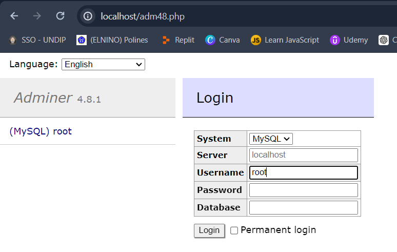
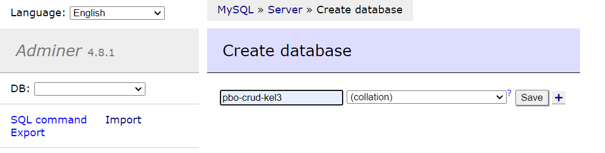

- masukan file adm48.php ke dalam folder C:\laragon\www (bila menggunakan laragon), C:\xampp\htdocs\ (bila menggunakan xampp)
- buka http://localhost/adm48.php (login username root) 
- create data base (pbo-crud-kel3) 
- import file dataku.php 
- 

cara menjalankan program
